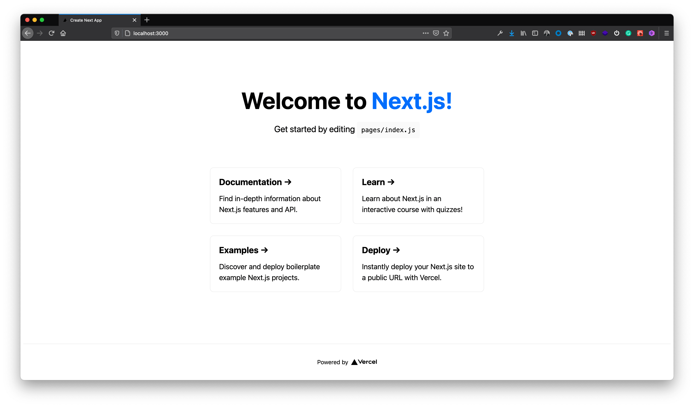
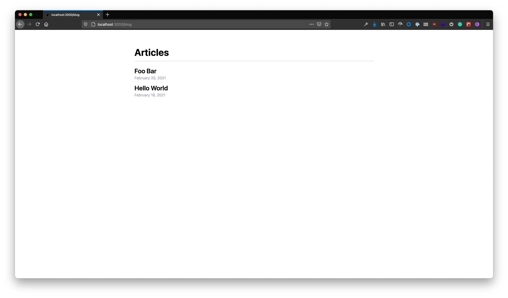
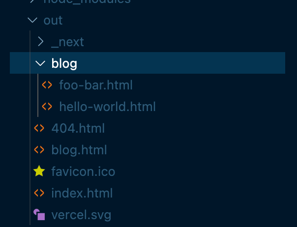
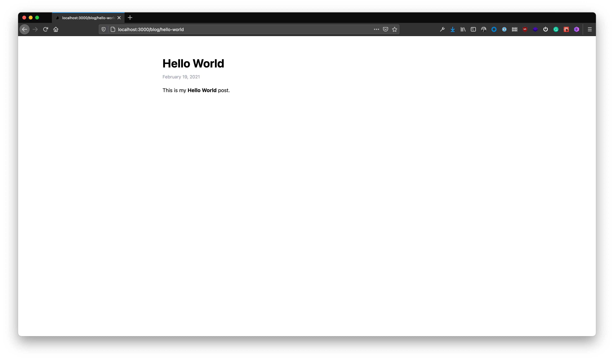
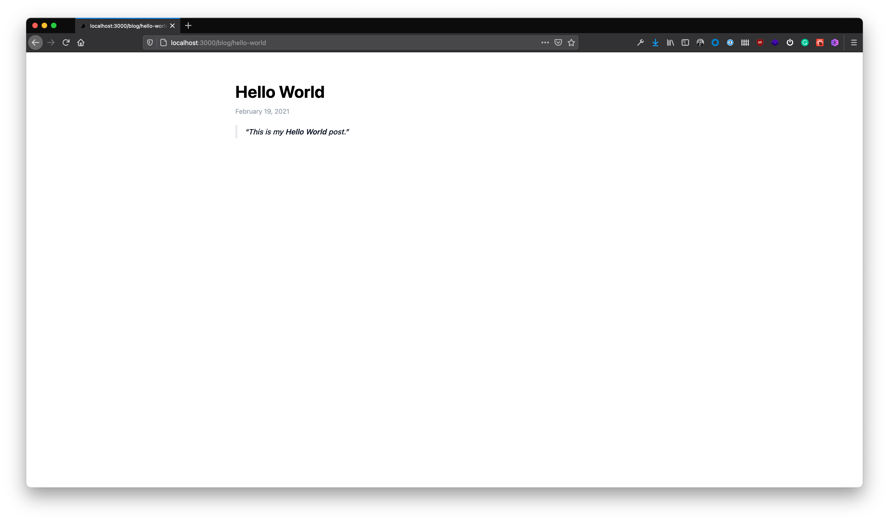
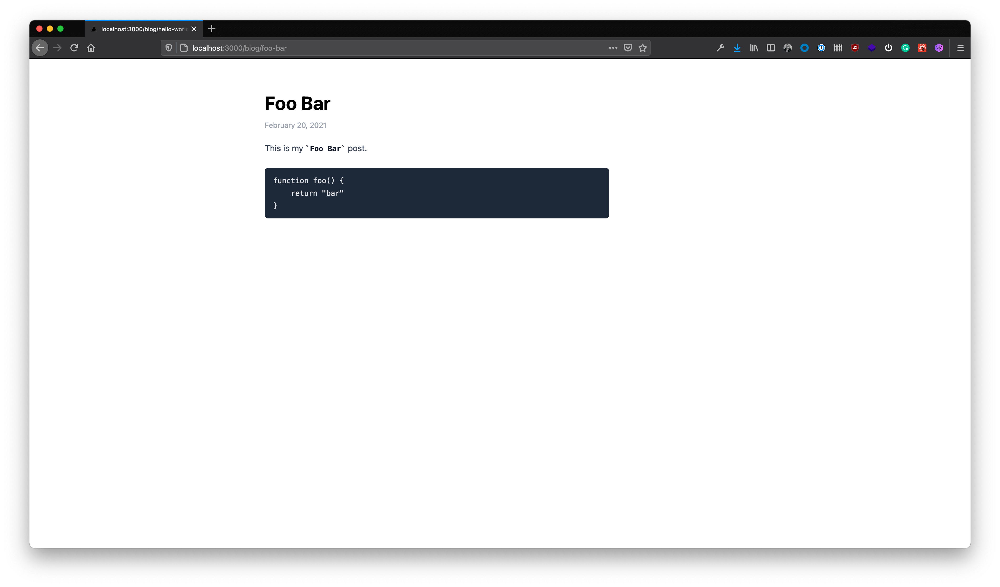

This website is built using [Next.js](https://nextjs.org/) and [Tailwindcss](https://tailwindcss.com/) and it's been a blast. I want to write down what I've learned and what I did. So in this article, we're gonna build a simple blog website. This website will allow user to write articles in Markdown.

Next.js is a popular [**React**](https://reactjs.org/) framework and it supports [Static Generation](https://nextjs.org/docs/basic-features/pages#static-generation-recommended) which is perfect for our use case. For those who don't know, Static Generation is a process to generate the static website at **build time**. Normally, a traditional website has to be rebuilt for every visit. Static websites are built before they go live, and so instead of building 1 million times for 1 million visitors, they build once. This website will then be reused on each request and can be cached by a CDN for performance.

### Project Setup

This is the environment we use in this guide:

```bash
> node -v
v15.9.0

> npm -v
7.5.3
```

You can install Node.js from [here](https://nodejs.org/en/download/). I'm using [fnm](https://github.com/Schniz/fnm) to manage my node.js environment.

#### Create a new Next.js project

Let's create a new Next.js project using `create-next-app` and start the dev server:

```bash
> npx create-next-app nextjs-blog
> cd nextjs-blog
# start the dev server
> npm run dev
```

Open [http://localhost:3000](http://localhost:3000) in your browser, you will see this default Next.js info page:


#### Install all required packages

Now we have a new Next.js project running, but we still need to install some packages to ease our job on building this website. Run this command in terminal:

```bash
> npm install -D gray-matter uniqid remark remark-html tailwindcss@latest postcss@latest autoprefixer@latest @tailwindcss/typography dayjs
```

Let me explain why we need each of them:

- `gray-matter`: converts a string with YAML front-matter into an object so we can use the value in JavaScript

from:

```markdown
---
title: Hello
slug: home
---

<h1>Hello world!</h1>
```

to:

```js
{
  content: '<h1>Hello world!</h1>',
  data: {
    title: 'Hello',
    slug: 'home'
  }
}
```

- `uniqid`: to generate unique ID for our list because React requires unique key for every elements in a list
- `remark`: to process our Markdown content
- `remark-html`: to serialize Markdown as HTML
- `tailwindcss`: to style our website
- `postcss`: required by `tailwindcss`
- `autoprefixer`: required by `tailwindcss`
- `tailwindcss/typography`: to style the HTML elements generated from our Markdown files
- `dayjs`: to format the date value

#### Config Tailwindcss

Next, we have to generate `tailwind.config.js` and `postcss.config.js` files in our project:

```bash
npx tailwindcss init -p
```

Open the `./styles/global.css` file in the project, use the `@tailwind` directive to include Tailwind's `base`, `components`, and `utilities` styles, replacing the original file contents:

```css
@tailwind base;
@tailwind components;
@tailwind utilities;
```

Open `./tailwindcss.config.js` file, add `@tailwindcss/typography` to the plugins list:

```diff
module.exports = {
  ...
  variants: {
    extend: {},
  },
-  plugins: [],
+  plugins: [require('@tailwindcss/typography')],
}
```

Start the server again to make sure **everything is still working**.

### Project route

The website we're going to build will have these pages:

- `/blog`: the blog posts list
- `/blog/hello-world`: the **Hello World** article
- `/blog/foo-bar`: the **Foo Bar** article

Let's see how we can do this. Next.js has a [file-system based router](https://nextjs.org/docs/routing/introduction). When a file is added to the `./pages` directory it's automatically available as a route:

- `./pages/index.js` -> `/`
- `./pages/blog/index.js` -> `/blog`
- `./pages/blog/analytics.js` -> `/blog/analytics`

Nobody wants to write a new page, e.g. `./pages/blog/hello-world.js`, whenever there is a new article. Therefore, we need a more scalable way to handle this. As we know every article page logic is the same, to display the content from the `.md` file, we can use Next.js [Dynamic Routes](https://nextjs.org/docs/routing/dynamic-routes) to handle the same route pattern with the same file:

- `./pages/blog/[slug].js` -> will match `/blog/1`, `/blog/hello-world`, `/blog/foo-bar`

Let's create both files:

```bash
# create blog folder under pages folder
> mkdir pages/blog
# create index.js file and [slug].js file under blog folder
> touch pages/blog/index.js pages/blog/\[slug\].js
```

We also need a folder to store all our Markdown files (`.md`). Let's create a `./posts` folder and few articles:

```bash
# create posts folder
> mkdir posts
# create 2 markdown files for testing purpose
> touch posts/hello-world.md posts/foo-bar.md
```

Open `./posts/hello-world.md` and add:

```markdown
---
title: "Hello World"
slug: hello-world
date: "2021-02-19"
---

> This is my **Hello World** post.
```

Same with `./posts/foo-bar.md`:

````markdown
---
title: "Foo Bar"
slug: foo-bar
date: "2021-02-20"
---

This is my `Foo Bar` post.

```js
function foo() {
  return "bar"
}
```
````

### Blog Engine

Now we can start writing our blog engine. The purpose of the blog engine is to read all `.md` files in `./posts` folder and generate static HTML at **build time**.

#### Blog Posts List page

Let's go to `./pages/blog/index.js` and start to create the function to display the blog posts list:

```js
import Link from "next/link"
import dayjs from "dayjs"

export default function Blog({ posts }) {
  return (
    <div className="container mx-auto mt-16 w-6/12 divide-y-2">
      <h1 className="font-bold text-4xl mb-3">Articles</h1>
      <ul className="pt-5">
        {posts.map(post => (
          <li className="mb-3" key={post.id}>
            <Link href={`/blog/${post.slug}`}>
              <a className="font-semibold text-2xl hover:text-red-500">
                {post.title}
              </a>
            </Link>
            <p className="text-sm text-gray-400">
              {dayjs(post.date).format("MMMM D, YYYY")}
            </p>
          </li>
        ))}
      </ul>
    </div>
  )
}

// this function will get called at build time
export async function getStaticProps() {
  const fs = require("fs")
  const matter = require("gray-matter")
  const uniqid = require("uniqid")

  const postsDir = `${process.cwd()}/posts`

  const files = fs.readdirSync(postsDir, "utf-8")
  const posts = files
    .filter(file => file.endsWith(".md"))
    .map(file => {
      const rawContent = fs.readFileSync(`${postsDir}/${file}`, {
        encoding: "utf8",
      })
      const { data } = matter(rawContent)

      return { ...data, id: uniqid() }
    })
    .sort((a, b) => new Date(b.date) - new Date(a.date))

  return {
    props: { posts },
  }
}
```

The `getStaticProps` function will get called at build time. In the function we are reading all the `.md` files and sort them in descending order by the `date` value so the newest post is showed at the top. The `Blog` component will receive the `posts` as props because we return them in `getStaicProps` function.

Start the dev server and open [http://localhost:3000/blog](http://localhost:3000/blog), you can now see this page show all our articles:


#### Article Page

In order to display our articles on the correct page accordingly, we need to read the `.md` file based on the `slug` value from the URL, and also generate different HTML for each page.

- `/blog/hello-world`: the `slug` value is `hello-world`, so it should display the article from `./posts/hello-world.md`
- `/blog/foo-bar`: the `slug` value is `foo-bar`, so it should display the article from `./posts/foo-bar.md`

Let's write the logic in `./posts/[slug].js`:

```jsx
import dayjs from "dayjs"

export default function BlogPostPage(props) {
  const { title, content, date } = props.post

  return (
    <div className="container mx-auto mt-16 w-6/12">
      <h1 className="font-bold text-4xl mb-3">{title}</h1>
      <p className="text-sm text-gray-400">
        {dayjs(date).format("MMMM D, YYYY")}
      </p>
      <section className="mt-5" dangerouslySetInnerHTML={{ __html: content }} />
    </div>
  )
}

// this function will get called at build time
export async function getStaticProps(context) {
  const fs = require("fs")
  const remark = require("remark")
  const html = require("remark-html")
  const matter = require("gray-matter")

  const postsDir = `${process.cwd()}/posts`

  const { slug } = context.params
  const rawContent = fs.readFileSync(`${postsDir}/${slug}.md`)
  const { data, content } = matter(rawContent)

  const result = await remark().use(html).process(content)

  return {
    props: {
      post: {
        ...data,
        content: result.toString(),
      },
    },
  }
}

// this function will get called at build time
export async function getStaticPaths(context) {
  const fs = require("fs")
  const files = fs.readdirSync(`${process.cwd()}/posts`, "utf-8")

  const filenames = files
    .filter(file => file.endsWith(".md"))
    .map(file => file.replace(".md", ""))

  return {
    paths: filenames.map(filename => ({
      params: {
        slug: filename,
      },
    })),
    fallback: false,
  }
}
```

In `getStaticProps` function, we use `remark` and `remark-html` to parse `.md` file content into HTML then pass to `BlogPostPage` component as props.

We also use another function provided by Next.js called `getStaticPaths`. When we `export` an `async` `getStaticPaths` function from a dynamic page (`./pages/blog/[slug].js` in this case), this function will get called at build time and generate the HTML file accordingly.

Let's check the file generated from our codes so far. Add `next export` command in `package.json` file:

```diff
  ...
  "scripts": {
    "dev": "next dev",
-    "build": "next build",
+    "build": "next build && next export",
    "start": "next start"
  },
  ...
```

then run in terminal:

```bash
> npm run build
```

These generated files are in the `out` folder including `foo-bar.html` and `hello-world.html` because of the `getStaticPaths` function:


Run the server and open [`http://localhost:3000/blog/hello-world`](http://localhost:3000/blog/hello-world). We can see the content of the article now:


#### Style the Generated HTML

As you may have noticed that our content is not styled properly, e.g. the `<backquote>` in this case. Tailwind provides a very easy way to automatically style the HTML elements for us using [Tailwind Typography](https://github.com/tailwindlabs/tailwindcss-typography).

All we have to do is to add `prose` class in `./posts/[slug].js`:

```diff
// ...
export default function BlogPostPage(props) {
    const { title, content, date } = props.post

    return (
        <div className="container mx-auto mt-16 w-6/12">
            <h1 className="font-bold text-4xl mb-3">{title}</h1>
            <p className="text-sm text-gray-400">{dayjs(date).format('MMMM D, YYYY')}</p>
-            <section className="mt-5" dangerouslySetInnerHTML={{__html: content}} />
+            <section className="mt-5 prose" dangerouslySetInnerHTML={{__html: content}} />
        </div>
    )
}
// ...
```

The `<backquote>` element now looks good in [http://localhost:3000/blog/hello-world](http://localhost:3000/blog/hello-world):


The code block in [http://localhost:3000/blog/foo-bar](http://localhost:3000/blog/foo-bar) is also styled nicely:


That completes this simple guide on building a blog with Next.js and Tailwindcss. Now you are ready to show the world what you've done by deploying this blog using [Vercel](https://vercel.com/) or [Netlify](https://www.netlify.com/). Cheer!

You can check the [source codes here](https://github.com/jk-gan/nextjs-blog).
