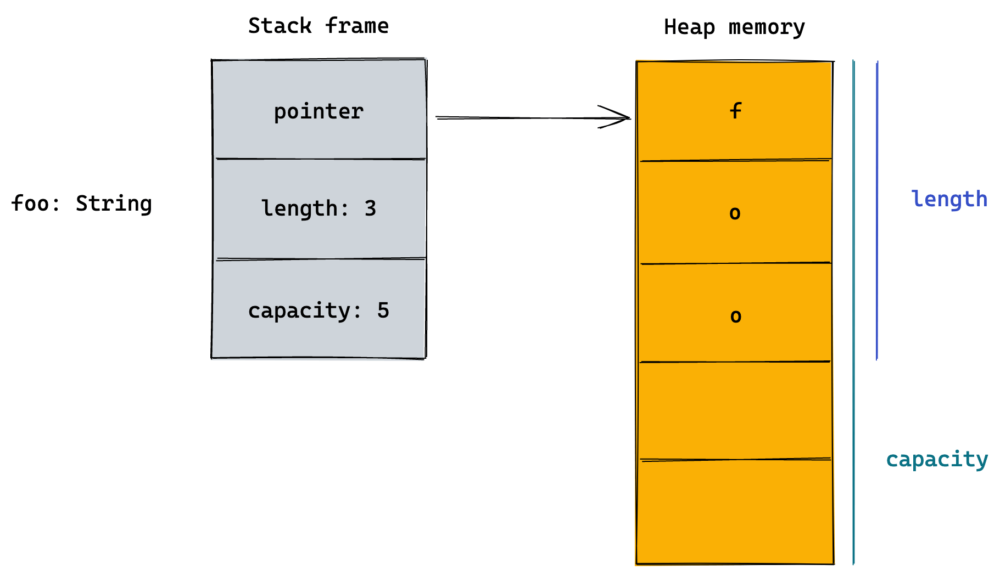
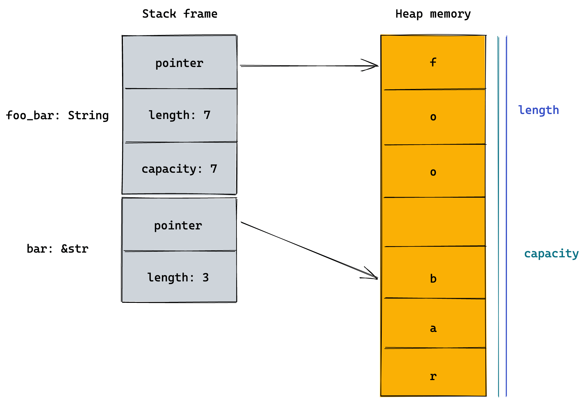
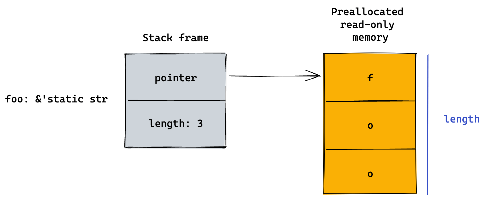

If you are new to Rust, chances are you would be confused by Rust's different string types. Let's take a look at probably the first error you will face when building your first Rust program:

```rust
fn greeting(object: String) {
    println!("Hello, {}", object);
}
```

Here we have a function expecting a `String` as parameter. Let's call this function with a "`String`":

```rust
let world = "world";
greeting(world);
```

We're happy with this code. With so many experiences in programming, what could go wrong with this "Hello world" program? Well, the compiler disagrees with us:

```bash
error[E0308]: mismatched types
 --> src/main.rs:7:14
  |
7 |     greeting(world);
  |              ^^^^^
  |              |
  |              expected struct `String`, found `&str`
  |              help: try using a conversion method: `world.to_string()`

error: aborting due to previous error

For more information about this error, try `rustc --explain E0308`.
error: could not compile `learn`
```

So what we did was passing something looks like a string (`&str`) but not a real string value into a function that is expecting a `String`. Luckily, the compiler shows us this can be fixed by using `to_string()` function. Let's try it:

```rust
let world = "world".to_string();
greeting(world);
```

```bash
❯ cargo run
   Compiling learn v0.1.0 (/Users/junkai/Developer/Rust/learn)
    Finished dev [unoptimized + debuginfo] target(s) in 0.32s
     Running `target/debug/learn`
Hello, world
```

Nice! The compiler is happy now and output "Hello, world". But what is `String` and `str`?

### What is `String`?

There are 2 main string types in Rust, `str` and `String`. The `String` type is provided by Rust's standard library. It is actually just a [wrapper of `Vec<u8>`](https://github.com/rust-lang/rust/blob/master/library/alloc/src/string.rs#L272-L281) with the guarantees of UTF-8 encoding.

`String` is:

- heap-allocated
- mutable
- growable

```rust
let mut foo = "foo".to_string();
asset_eq!(foo.len(), 3);
asset_eq!(foo.capacity(), 3);

foo.push_str(" bar");
asset_eq!(foo.len(), 7);
asset_eq!(foo.capacity(), 8);
```

- owned (you might want to study the [ownership](https://doc.rust-lang.org/stable/book/ch04-01-what-is-ownership.html) first)

```rust
let string = "This is string".to_string();
let another_string = string;

println!("another_string: {}", another_string); // this is valid
println!("string: {}", string); // this is not valid
```

```bash
# compilation error:
error[E0382]: borrow of moved value: `string`
 --> src/main.rs:6:28
  |
2 |     let string = "This is string".to_string();
  |         ------ move occurs because `string` has type `String`, which does not implement the `Copy` trait
3 |     let another_string = string;
  |                          ------ value moved here
...
6 |     println!("string: {}", string);
  |                            ^^^^^^ value borrowed here after move

error: aborting due to previous error

For more information about this error, try `rustc --explain E0382`.
error: could not compile `learn`
```

- UTF-8 encoded

```rust
let emoji = "🤔";
println!("emoji: {}", emoji);
```

```bash
# output:
emoji: 🤔
```

This is how we declare a `String` variable in Rust:

```rust
let foo = "foo".to_string();
// or
let foo = "foo".to_owned();
// or
let foo = String::from("foo");
```

A `String` is made up of **3** components:

- pointer to heap-allocated buffer
- length
- capacity
  The size of the `String` object is 3 words long. Here’s what a `String` looks like in memory:



### What is `str`?

According to [Rust documentation](https://doc.rust-lang.org/std/primitive.str.html),

> The `str` type, also called a 'string slice', is the most primitive string type. It is usually seen in its borrowed form, `&str`. It is also the type of string literals, `&'static str`.
> String slices are always valid UTF-8.

A `&str` is made up of **2** components:

- pointer to heap-allocated buffer
- length

#### String slice

We can create **string slice** using `[starting_index..ending_index]` syntax, where `starting_index` is the first position in the slice and `ending_index` is one more than the last position in the slice:

```rust
let foo_bar = "foo bar".to_string();
let bar = &foo_bar[4..]; // bar is string slice from `foo_bar` start from index 4 to the last byte of `foo_bar`
```

Here's what it looks like in memory:



The `bar` is just a reference to a portion of the `foo_bar`.

You can read more about string slice [here](https://doc.rust-lang.org/book/ch04-03-slices.html).

#### String literal

Next, we have **string literal**. The way we declare a **string literal** is the same as how we declare a string variable in other languages:

```rust
let foo = "foo";
```

The `foo` variable with an explicit type annotation would be:

```rust
let foo: &'static str = "foo";
```

The `foo` is `'static` because **string literal** is stored directly in the final binary, and so will be valid for the `'static` duration. It’s a slice pointing to that specific point of the binary. This is also why string literals are **immutable**; `&str` is an **immutable reference**.

Here’s what a string literal looks like in memory:



### Bonus: you can pass `&String` to a function expecting `&str`

It's quite common when you have a function expecting a `&str` because you don't want to own the value, but the string you want to pass in is a `String`. This is actually very easy to solve by passing the reference of the `String` (`&String`). `String`s will coerce into `&str` with an `&`:

```rust
// because `String` implement `Deref<Target=str>`
// the source code at here: https://github.com/rust-lang/rust/blob/master/library/alloc/src/string.rs#L2135-L2143
impl ops::Deref for String {
    type Target = str;

    fn deref(&self) -> &str { ... }
}

// therefore we can pass `&String` to a function expecting `&str`
fn count_the_len(string: &str) -> usize {
    string.len()
}

// it is a `String`
let hello = String::from("Hello World");
// we can borrow it into a function expecting `&str`
assert!(11, count_the_len(&hello));

```

According to [Rust documentation](https://doc.rust-lang.org/std/string/struct.String.html#deref),

> This conversion is very inexpensive, and so generally, functions will accept `&str`s as arguments unless they need a `String` for some specific reason.
> Therefore, when working with string, it makes sense to create function expecting `&str`s so it will support both `&str` and `String` by default.

### Which one should I use?

`String` is a mutable and owned while `str` is immutable. Generally, if you don't want to own or mutate the string value, you should be using `&str`, and vise versa.

_For deeper explanation of this topic, I recommend this [article](https://fasterthanli.me/articles/working-with-strings-in-rust) from [@fasterthanlime](https://twitter.com/fasterthanlime)._
